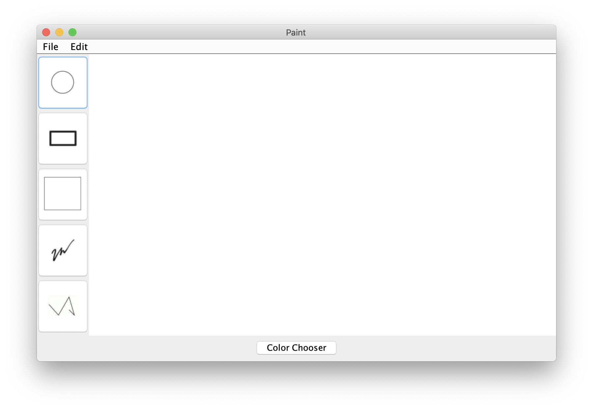
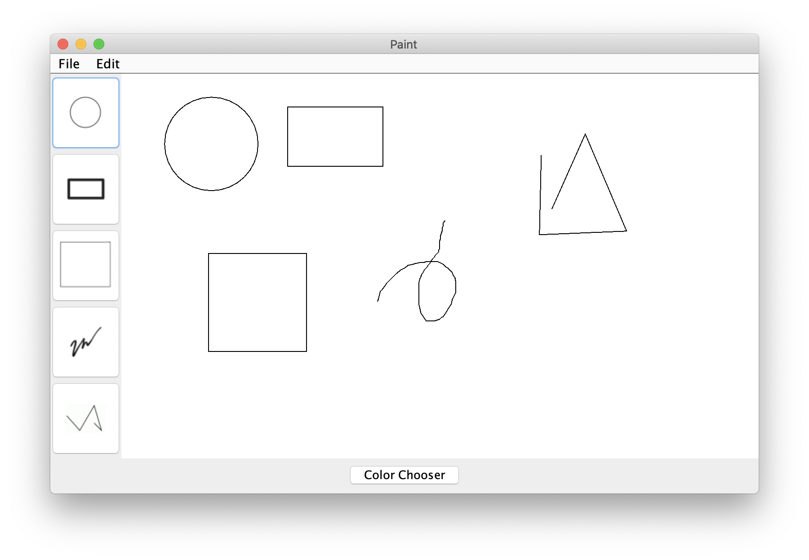

# Paint

A group project done with four partners in Eclipse. It involved an agile (SCRUM) development approach alongside the version control GIT. The program uses the Model-View-Controller (MVC) Pattern, Object-Oriented Programming (OOP), and Swing Components (JFrames, JObjects, etc.) to create a miniature Microsoft Paint.

## Paint Interface

## Paint with Shapes

## Color Chooser

