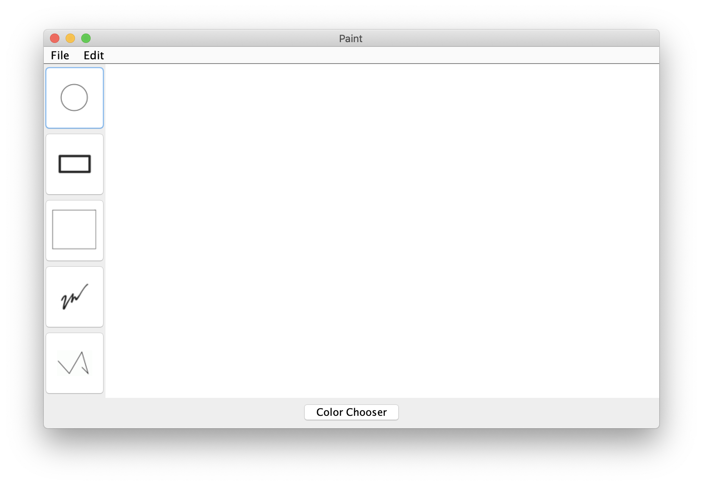
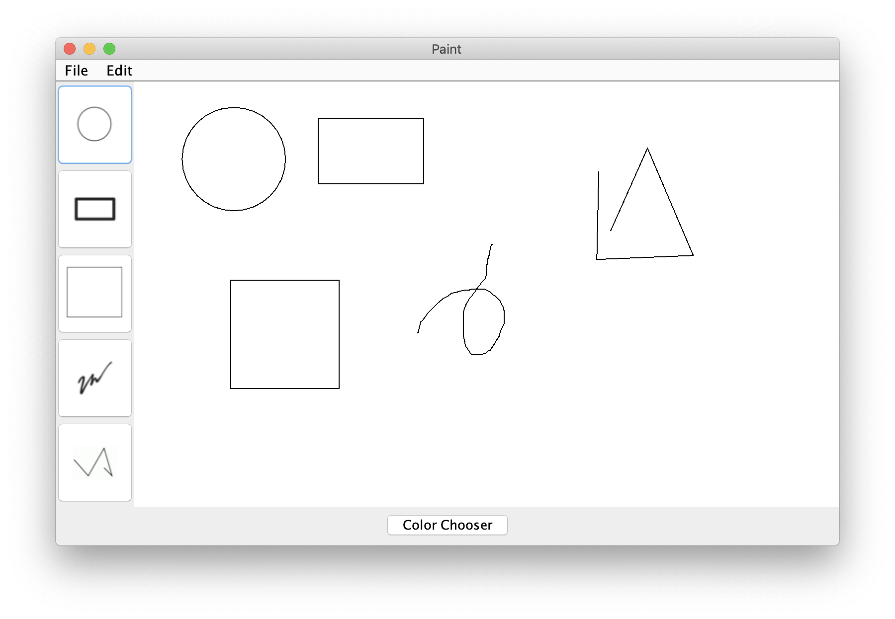
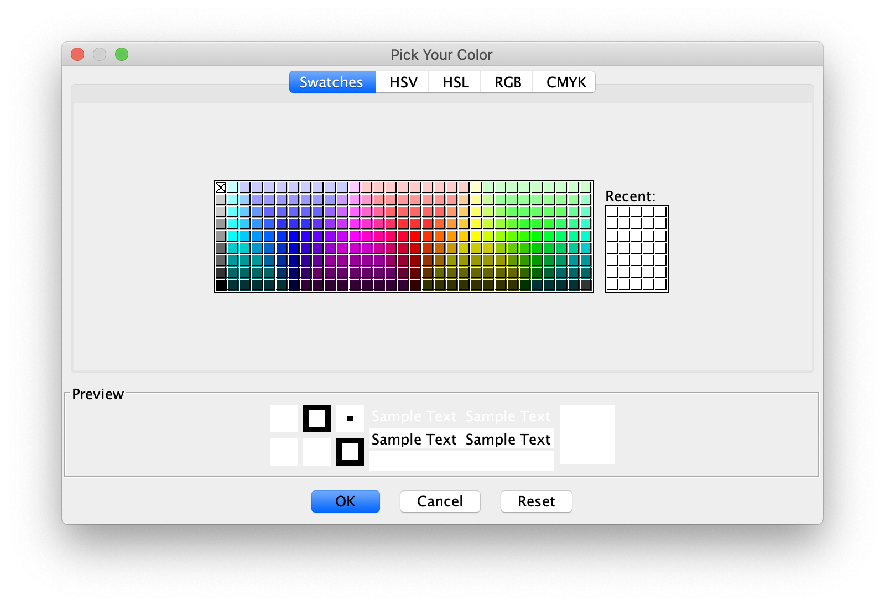

# CSC207: Software Design

This repository contains a project from CSC207: Software Design course taken at University of Toronto Mississauga.

## Paint

A group project done with four partners in Eclipse. It involved an agile (SCRUM) development approach alongside the version control GIT. The program uses the Model-View-Controller (MVC) Pattern, Object-Oriented Programming (OOP), and Swing Components (JFrames, JObjects, etc.) to create a miniature Microsoft Paint.

## Interface

* [Main](#main)
* [Main with Shapes](#main-with-shapes)
* [Color Chooser](#color-chooser)

### Main

### Main with Shapes

### Color Chooser

